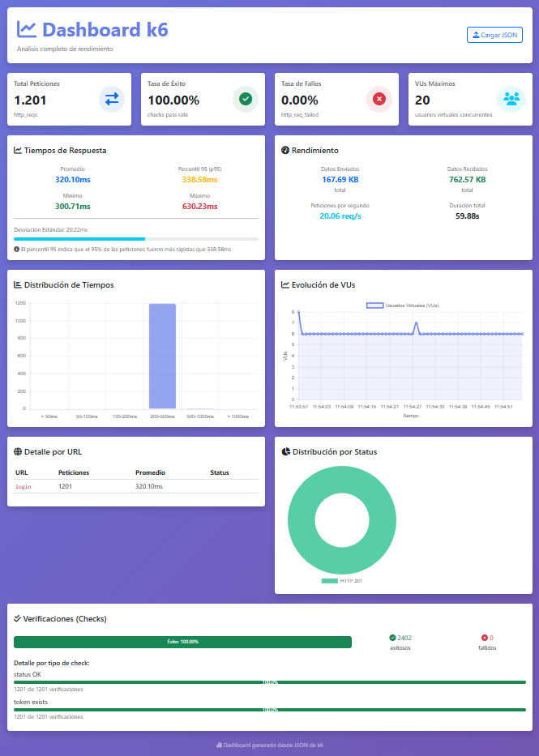

# EJERCICIO 1 - PRUEBA DE CARGA LOGIN API (K6)


## 1. DESCRIPCIÓN

Este proyecto realiza una prueba de carga sobre un servicio de login utilizando **k6**.

Se parametrizan credenciales desde un archivo CSV y se valida:

* Tiempo de respuesta del endpoint
* Existencia de token en la respuesta
* Tasa de error bajo carga

El escenario está diseñado para alcanzar al menos **20 TPS constantes**.

---

## 2. TECNOLOGÍAS UTILIZADAS

- k6: 1.6.1
- Node.js: 20+
- Windows

---

## 3. ESTRUCTURA DEL PROYECTO

```
.
├── fakestoreapi.js         # Script principal de k6
├── users.csv               # Datos de prueba (sin cabecera)
├── index.html              # Dashboard de resultados (k6 template)
├── resultados.json         # Reporte generados
├── README.md
├── InformeResultados.docx  # Informe del ejercicio 2
└── conclusiones.txt
```

---

## 4. FORMATO DEL CSV

El archivo `users.csv` contiene:

```
user,passwd
```

Ejemplo:

```
donero,ewedon
kevinryan,kev02937@
johnd,m38rmF$
derek,jklg*_56
mor_2314,83r5^_
```

📌 Nota:
El archivo no incluye cabecera en ejecución para evitar lectura innecesaria y optimizar el parsing en escenarios de carga.

---

## 5. EJECUCIÓN DEL TEST

### 1. Instalar k6

[https://k6.io/docs/get-started/installation/](https://k6.io/docs/get-started/installation/)

### 2. Ejecutar el script

```bash
k6 run --out json=resultados.json fakestoreapi.js
```

### 2. Visualizar datos

Abrir el archivo index.html y cargar el archivo generado en resultados.json

## 6. CRITERIOS DE VALIDACIÓN

Durante la ejecución se valida:

* Tiempo de respuesta < 1500 ms
* Tasa de error < 3%
* Respuesta contiene campo `token` no vacío
* Carga estable de mínimo 20 TPS

---

## 7. VISUALIZACIÓN DE RESULTADOS

Se incluye un `index.html` basado en:

[https://github.com/mizunie/k6-template](https://github.com/mizunie/k6-template)

Permite visualizar métricas del test de forma gráfica.

### Evidencia



---

## 8. NOTAS DE DISEÑO

* Uso de `SharedArray` para evitar recarga de datos por VU
* Parsing optimizado del CSV para reducir overhead
* Escenario `constant-arrival-rate` para asegurar TPS constante
